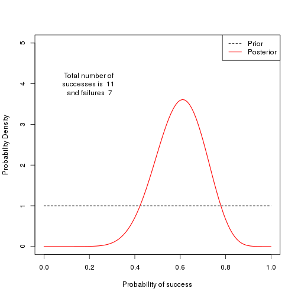
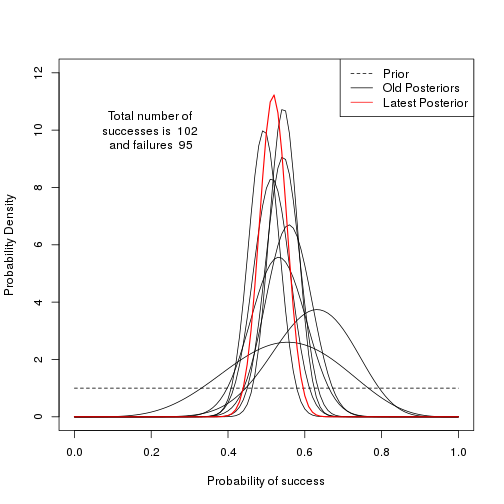

Visual illustration of Bayesian updating of probability of success
========================================================
author: L. Uusitalo
date: 16 September 2015

Motivation    
========================================================

This interactive Shiny app visualizes Bayesian updating of the probability of success, 
as we gather more and more observations of successes and failures.

You can think of think as a coin toss, with the difference that we don't know what are the respective probabilities of heads and tails. We flip the coin several times, recording the results, and
these observations give us a better basis to estimate the probability of heads.

Read more about Bayesian statistics here: https://en.wikipedia.org/wiki/Bayesian_inference.

Updating code modified from http://bayesianbiologist.com/2011/09/10/visualizing-bayesian-updating/

Example of the updating
========================================================

The estimate before seeing any data, i.e. the *prior probability*, is uniform between 0 and 1. 

This figure shows the prior and the updated estimate 
(the *posterior*) after having observed 11 successes and 7 failures.
***
 

Understanding knowledge accumulation
========================================================

- **Mimics real life situation**: 
   - Add new observations as you get them
   - Watch your best estimate of the success probability develop

- The latest posterior (*using all the accumulated data*) in red
- all the previous posteriors shown in black

--> Easy to see how the estimate changes and improves as data accumulates

This is how it could look like after 9 batches of data
========================================================

 

